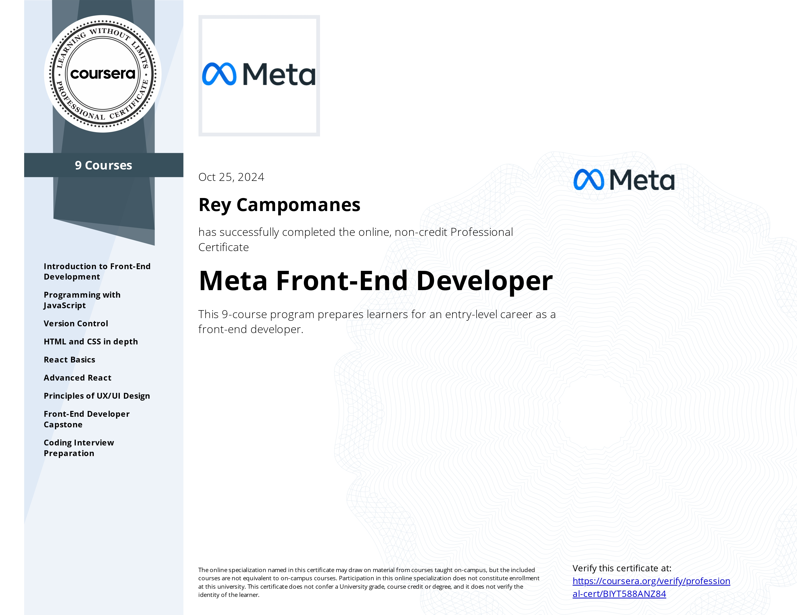

# Meta Front-End Developer Capstone

## Little Lemon - Reservation Feature

This project is part of my **Meta Front-End Developer** Capstone course on Coursera. The main objective of this project is to create an online reservation feature for a restaurant named Little Lemon.

### Table of Contents

1. [Project Overview](#project-overview)
2. [Features](#features)
3. [Future Plans](#future-plans)
4. [Technologies Used](#technologies-used)
5. [How to Run the Project](#how-to-run-the-project)
6. [Video Demo](#video-demo)
7. [Certificate](#certificate)

### Project Overview

The Little Lemon project is designed to allow users to reserve tables at the restaurant through an online interface. Currently, the project consists of a homepage and a reservation page, where users can fill out a form to book their table. The reservation system uses form validation and a calendar for selecting the date.

The project is still in its early stages and will be expanded with additional features and design improvements in future iterations.

### Features

- Users can book a table online through the reservation page.
- Form validation using [**Formik**](https://formik.org/) and [**Yup**](https://www.npmjs.com/package/yup) libraries.
- Date selection functionality using [**react-calendar**](https://www.npmjs.com/package/react-calendar).

### Future Plans

- Implement a responsive design to improve accessibility on mobile and tablet devices.
- Expand the project by adding more pages such as the menu page, contact page, and about page.
- Improve user experience and design aesthetics on the homepage and reservation page.

### Technologies Used

- **ReactJS:** Main library used for building the user interface.
- **HTML/CSS:** For structuring and styling the web pages.
- **Formik:** To manage form state and handle validation.
- **Yup:** Used for form validation schemas.
- **react-calendar:** Library for date selection within the reservation form.

### How to Run the Project

1. Clone the repository.

```bash
git clone https://github.com/campomanesreyc/meta-frontend-capstone.git
```

2. Navigate to the project directory.

```bash
cd meta-frontend-capstone
```

3. Install the necessary dependencies.

```bash
npm install
```

4. Navigate to the Little Lemon App.

```bash
cd ./little-lemon
```

5. Run the project

```bash
npm start
```

### Video Demo

Watch the video demo of the reservation feature:

[](https://www.youtube.com/watch?v=nWj085nFmmc)

### Certificate

View or download the certificate below.

[](meta-frontend-developer.pdf)
